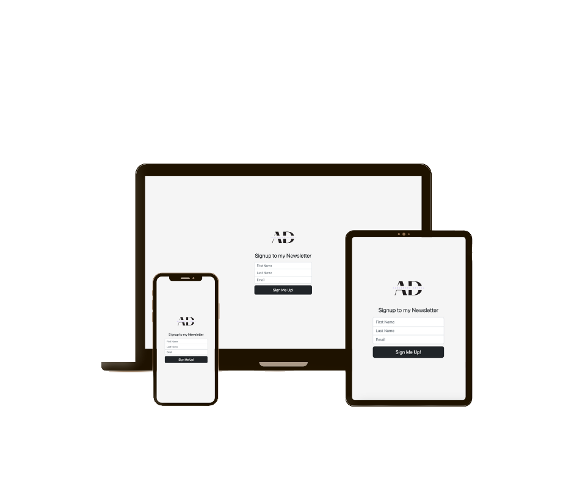

# Newsletter Signup
A functional form for people who wants to subscribe to your newsletter. This app is built using Node.js, Express.js, and Mailchimp API which allows you to sign people up for the mailing list. Contacts are going to Mailchimp, where you can manage your list and decide when and which email to send.
## Run the app

> npm install

> node app.js

## Screenshots

