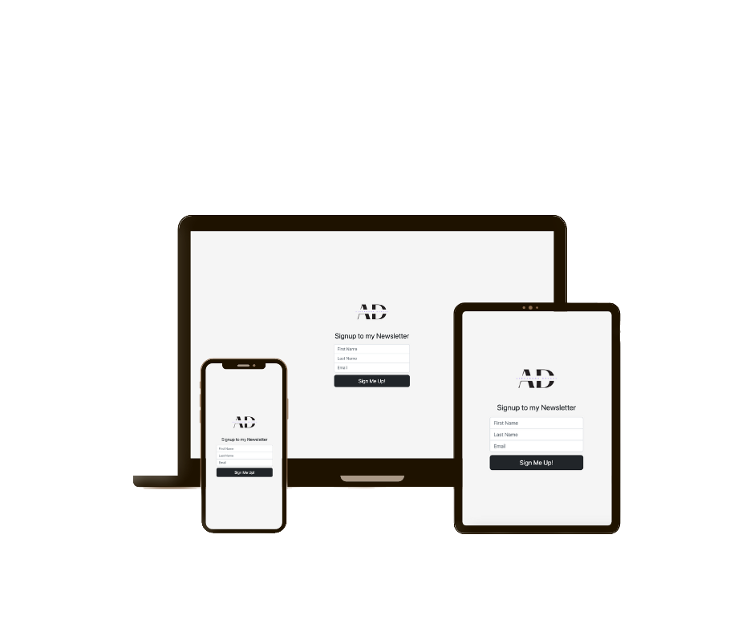

# Newsletter Signup
A functional form for people who wants to subscribe to your newsletter. This is an app built using Node.js, Express.js and Mailchimp API that allows to sign people up to the mailing list. Contacts are going to the Mailchimp where you can manage your list and decide when and which email to send. 

## Run the app

> npm install
> node app.js

## Screenshots

